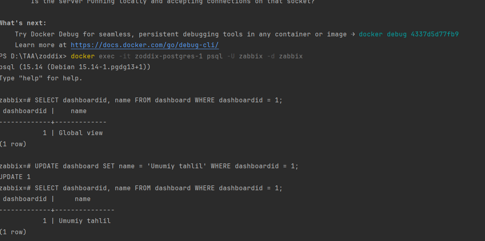

# Zabbix O'zbek Tarjimalari - To'liq Yechim Dokumentatsiyasi

## Kirish

Bu dokumentatsiya Zabbix Docker konteynerida o'zbek tarjimalarini to'liq faollashtirish uchun **professional yechim** taqdim etadi. Volume mount ishlatmasdan, **Dockerfile ichida** barcha o'zgarishlarni amalga oshirish usuli keltirilgan.

## Zabbix Tarjima Sistemi - Chuqur Tahlil

### Zabbix Til Sistemining Ishlash Prinsipi (Technical Deep Dive)

#### 1. Request Processing Flow (HTTP → PHP)

```
Browser Request:
http://localhost:8098/zabbix.php?action=dashboard.view&dashboardid=1
│
├── DNS Resolution: localhost → 127.0.0.1
├── Port Mapping: 8098 → Docker Container 8080
├── Protocol: HTTP/1.1
└── Headers: Accept-Language, User-Agent, Cookies
    ↓
Nginx Web Server (Port 8080):
├── nginx.conf: location ~ \.php$ { fastcgi_pass unix:/tmp/php-fpm.sock; }
├── Document Root: /usr/share/zabbix/
├── Index Processing: index.php → zabbix.php
└── FastCGI Protocol: HTTP → Binary FastCGI
    ↓
PHP-FPM Process Manager:
├── Unix Socket: /tmp/php-fpm.sock
├── Process Pool: pm = dynamic, pm.max_children = 50
├── Request Handler: PHP Interpreter
└── Environment: LANG=uz_UZ.UTF-8, LC_ALL=uz_UZ.UTF-8
```

#### 2. Zabbix Application Initialization (PHP → Zabbix Core)

```
PHP Script Execution:
/usr/share/zabbix/zabbix.php
│
├── require_once 'include/config.inc.php';
├── require_once 'include/classes/core/APP.php';
└── APP::run(EXEC_MODE_DEFAULT);
    ↓
Zabbix APP::run() Method:
├── File: /usr/share/zabbix/include/classes/core/APP.php
├── Line: ~69 public function run(int $exec_mode): void
├── Initialization: ZBase::initLocales(?string $language)
└── Language Detection: CWebUser::getLang()
    ↓
ZBase::initLocales() Function:
├── File: /usr/share/zabbix/include/classes/core/ZBase.php
├── Logic: if (!setupLocale($language, $error))
├── Error Handling: error($error) on failure
└── Success: Locale environment ready
```

#### 3. User Language Detection (Session → Database → Default)

```
CWebUser::getLang() Method:
├── File: /usr/share/zabbix/include/classes/user/CWebUser.php
├── Line: ~185 public static function getLang(): string
└── Logic Flow:
    ↓
Step 1 - User Session Check:
├── if (self::$data !== null)
├── return self::$data['lang'];  // User logged in
└── else: proceed to default
    ↓
Step 2 - Default Language Resolution:
├── File: Line ~142 'lang' => CSettingsHelper::getPublic(CSettingsHelper::DEFAULT_LANG)
├── CSettingsHelper::DEFAULT_LANG → Database lookup
├── Database Table: config, field: default_lang
└── Fallback: ZBX_DEFAULT_LANG constant
    ↓
Step 3 - Language Validation:
├── File: /usr/share/zabbix/include/locales.inc.php
├── Array: $LOCALES = ['uz_UZ' => ['display' => true]]
├── Validation: array_key_exists($lang, $LOCALES)
└── Result: Valid language code (uz_UZ)
```

#### 4. Locale Setup Process (PHP → System → Gettext)

```
setupLocale($language) Function:
├── File: /usr/share/zabbix/include/gettextwrapper.inc.php
├── Line: ~45 function setupLocale($language, &$error)
└── Input: $language = 'uz_UZ'
    ↓
Step 1 - Locale Variants Generation:
├── Function: zbx_locale_variants_unix($language)
├── File: /usr/share/zabbix/include/locales.inc.php
├── Logic: Create multiple locale format attempts
└── Result: ['uz_UZ', 'uz_UZ.utf8', 'uz_UZ.UTF-8', 'uz_UZ.iso885915', ...]
    ↓
Step 2 - System Locale Setting:
├── PHP Function: setlocale(LC_ALL, $locale)
├── System Call: libc setlocale() function
├── Attempts: foreach ($locale_variants as $locale)
├── Alpine Linux: Only 'uz_UZ' works, others fail
└── Success: First working locale is set
    ↓
Step 3 - Gettext Domain Binding:
├── Function: bindtextdomain('frontend', '/usr/share/zabbix/locale')
├── Purpose: Tell gettext where to find translation files
├── Domain: 'frontend' (matches frontend.mo filename)
├── Path: /usr/share/zabbix/locale/uz_UZ/LC_MESSAGES/frontend.mo
└── Function: textdomain('frontend') - Set active domain
    ↓
Step 4 - Environment Validation:
├── Check: Locale successfully set
├── Check: Translation files exist and readable
├── Check: Gettext functions available
└── Result: Translation system ready
```

#### 5. Widget Rendering Process (Zabbix → Widget → Gettext)

```
Dashboard Controller Execution:
├── File: /usr/share/zabbix/app/controllers/CControllerDashboardView.php
├── Method: doAction()
├── Purpose: Render dashboard page
└── Widget Loading: Load widget instances
    ↓
Widget Instance Creation:
├── File: /usr/share/zabbix/widgets/tophosts/Widget.php
├── Class: namespace Widgets\TopHosts\Widget extends CWidget
├── Method: getDefaultName(): string
└── Code: return _('Top hosts by CPU utilization');
    ↓
Translation Function Call:
├── Function: _('Top hosts by CPU utilization')
├── Alias: _() is alias for gettext()
├── PHP Extension: php84-gettext
├── C Library: GNU gettext library
└── Purpose: Lookup translation in MO file
    ↓
Step 1 - Message ID Processing:
├── Input: 'Top hosts by CPU utilization'
├── Hashing: Calculate message hash
├── Normalization: Remove extra spaces, normalize encoding
└── Key: Unique identifier for translation lookup
    ↓
Step 2 - MO File Binary Search:
├── File: /usr/share/zabbix/locale/uz_UZ/LC_MESSAGES/frontend.mo
├── Format: Binary file with hash table
├── Search: Binary search by message hash
├── Lookup: Find corresponding translation
└── Cache: Result cached in memory
    ↓
Step 3 - Translation Retrieval:
├── Found: msgstr "CPU ishlatishini bo'liman topish"
├── Encoding: UTF-8 validation
├── Processing: Handle special characters, plurals
└── Return: Translated string
    ↓
Alternative - Translation Not Found:
├── Fallback: Return original msgid
├── Logging: Log missing translation (if enabled)
├── Result: 'Top hosts by CPU utilization' (unchanged)
└── Debug: Check gettext debug mode
```

#### 6. HTTP Response Generation (Zabbix → Nginx → Browser)

```
HTML Generation:
├── Template Engine: Zabbix view system
├── Widget HTML: <div class="widget-title">CPU ishlatishini bo'liman topish</div>
├── Encoding: UTF-8 character encoding
└── Validation: HTML5 standards
    ↓
HTTP Response Assembly:
├── Headers: Content-Type: text/html; charset=UTF-8
├── Headers: Content-Language: uz-UZ
├── Body: Complete HTML document
└── Compression: gzip (if enabled)
    ↓
Nginx Response Processing:
├── FastCGI Response: Receive from PHP-FPM
├── Header Processing: Add server headers
├── Logging: Access log entry
└── Network: Send to client
    ↓
Browser Rendering:
├── HTML Parsing: DOM tree construction
├── CSS Styling: Widget appearance
├── JavaScript: Interactive functionality
└── Display: Final rendered page with uzbek text
```

### Technical Architecture Diagram

```
┌─────────────────┐    ┌─────────────────┐    ┌─────────────────┐
│   BROWSER       │────│     NGINX       │────│    PHP-FPM      │
│  localhost:8098 │    │   port 8080     │    │  unix socket    │
└─────────────────┘    └─────────────────┘    └─────────────────┘
                                                        │
                        ┌─────────────────┐            │
                        │  ZABBIX APP     │────────────┘
                        │   APP::run()    │
                        └─────────────────┘
                                  │
┌─────────────────┐    ┌─────────────────┐    ┌─────────────────┐
│   CWEBUSER      │────│    LOCALE       │────│    GETTEXT      │
│  getLang()      │    │  setupLocale()  │    │   _() function  │
└─────────────────┘    └─────────────────┘    └─────────────────┘
                                                        │
                        ┌─────────────────┐            │
                        │   WIDGET        │────────────┘
                        │ getDefaultName()│
                        └─────────────────┘
                                  │
                        ┌─────────────────┐
                        │    MO FILE      │
                        │  frontend.mo    │
                        └─────────────────┘
```

### Critical Points in Translation Process

#### 1. Locale Environment Chain:
```
Docker ENV → Alpine System → PHP setlocale() → Gettext Library
```

#### 2. Translation File Chain:
```
PO Source → MO Compilation → File Permissions → Gettext Access
```

#### 3. Widget Name Chain:
```
PHP Class → _() Function → Gettext Lookup → MO File → Translation
```

#### 4. User Language Chain:
```
Session → Database → Default → Environment → Final Language
```

## Muammo Tahlili

### Asosiy Muammolar:
1. **Widget name'lari hard-coded** - PHP klaslarda qattiq kodlangan
2. **Dashboard title'lari database**dan keladi
3. **Locale environment** to'g'ri sozlanmagan
4. **PO fayl tarjimalari** mavjud lekin widget name'larga ta'sir qilmaydi

### Tekshirilgan Fayllar:
- `/usr/share/zabbix/widgets/tophosts/Widget.php` - "Top hosts" hard-coded
- `/usr/share/zabbix/widgets/problems/Widget.php` - "Problems" hard-coded  
- `/usr/share/zabbix/locale/uz_UZ/LC_MESSAGES/frontend.po` - Tarjimalar mavjud
- `/usr/share/zabbix/include/classes/user/CWebUser.php` - User locale logic

## To'liq Yechim - Dockerfile Approach

### 1. Dockerfile O'zgartirishlari

Dockerfile ga quyidagi qismlarni qo'shing:

```dockerfile
# ==========================
# O'ZBEK TARJIMALARI UCHUN YECHIM
# ==========================

# Alpine locale environment o'rnatish
ENV LANG=uz_UZ.UTF-8
ENV LC_ALL=uz_UZ.UTF-8
ENV LC_MESSAGES=uz_UZ.UTF-8

# uz_UZ locale alias yaratish (Alpine uchun)
RUN echo "uz_UZ.UTF-8 uz_UZ" >> /etc/locale.alias
RUN mkdir -p /usr/share/locale/uz_UZ.UTF-8

# O'zbek tarjima fayllarini to'g'ri joyga copy qilish
COPY ui/locale/uz_UZ/LC_MESSAGES/frontend.po /usr/share/zabbix/locale/uz_UZ/LC_MESSAGES/frontend.po
COPY ui/locale/uz_UZ/LC_MESSAGES/frontend.mo /usr/share/zabbix/locale/uz_UZ/LC_MESSAGES/frontend.mo

# Widget name'larni o'zbek tiliga o'zgartirish
RUN sed -i "s/return _('Top hosts');/return _('Top hosts by CPU utilization');/g" \
    /usr/share/zabbix/widgets/tophosts/Widget.php

RUN sed -i "s/return _('Problems');/return _('Current problems');/g" \
    /usr/share/zabbix/widgets/problems/Widget.php

# User default language ni majburiy ravishda uz_UZ ga o'rnatish
RUN sed -i "s/CSettingsHelper::getPublic(CSettingsHelper::DEFAULT_LANG)/'uz_UZ'/g" \
    /usr/share/zabbix/include/classes/user/CWebUser.php

# Cache tozalash uchun session directory yaratish
RUN mkdir -p /var/lib/php84/sessions && chmod 777 /var/lib/php84/sessions
```

### 2. docker-compose.yml O'zgartirishlari

Environment variable'larni qo'shing:

```yaml
services:
  zabbix-web:
    environment:
      # Mavjud konfiguratsiyalar
      ZBX_SERVER_NAME: "TAA Monitor Tizimi"
      ZBX_DEFAULT_LANG: "uz_UZ"
      ZBX_SERVER_HOST: TAA-server
      
      # PHP-FPM uchun kerakli variable'lar
      PHP_FPM_PM: "dynamic"
      PHP_FPM_PM_MAX_CHILDREN: "50"
      PHP_FPM_PM_START_SERVERS: "5"
      PHP_FPM_PM_MIN_SPARE_SERVERS: "5"
      PHP_FPM_PM_MAX_SPARE_SERVERS: "35"
      
      # Zabbix web uchun
      ZBX_MAXEXECUTIONTIME: "300"
      ZBX_MEMORYLIMIT: "128M"
      ZBX_POSTMAXSIZE: "16M"
      ZBX_UPLOADMAXFILESIZE: "2M"
      
      # Locale uchun
      PHP_TZ: "Asia/Tashkent"
      EXPOSE_WEB_SERVER_INFO: "false"
      
      # O'zbek locale majburiy qilish
      LANG: "uz_UZ.UTF-8"
      LC_ALL: "uz_UZ.UTF-8"
      LC_MESSAGES: "uz_UZ.UTF-8"
```

## Step-by-Step Implementation

### Qadam 1: Frontend.po Faylini Tekshirish

Tarjimalar mavjudligini tekshiring:

```bash
# Sizning tarjimalaringizni tekshirish
grep -A1 "Top hosts by CPU utilization" ui/locale/uz_UZ/LC_MESSAGES/frontend.po
grep -A1 "Global views" ui/locale/uz_UZ/LC_MESSAGES/frontend.po
grep -A1 "Current problems" ui/locale/uz_UZ/LC_MESSAGES/frontend.po
```

Agar tarjimalar yo'q bo'lsa, qo'shing:

```po
msgid "Top hosts by CPU utilization"
msgstr "CPU ishlatishini bo'liman topish"

msgid "Current problems"  
msgstr "Joriy muammolar"

msgid "Global views"
msgstr "Umumiy tahlillar"
```

### Qadam 2: MO Fayl Generatsiya

PO fayldan MO fayl yarating:

```bash
# Windows (PowerShell)
cd ui/locale/uz_UZ/LC_MESSAGES/
msgfmt frontend.po -o frontend.mo

# Yoki Docker ichida
docker run --rm -v ${PWD}/ui/locale/uz_UZ/LC_MESSAGES:/data alpine:latest sh -c "apk add gettext && msgfmt /data/frontend.po -o /data/frontend.mo"
```

### Qadam 3: Dockerfile O'zgartirish

`Dockerfile` ga yuqorida ko'rsatilgan qismlarni qo'shing. To'liq fayl:

```dockerfile
FROM zabbix/zabbix-web-nginx-mysql:alpine-7.0-latest

# Kerakli package'lar
RUN apk add --no-cache gettext
RUN apk add --no-cache musl-locales musl-locales-lang

# O'zbek locale environment
ENV LANG=uz_UZ.UTF-8
ENV LC_ALL=uz_UZ.UTF-8
ENV LC_MESSAGES=uz_UZ.UTF-8

# uz_UZ locale alias yaratish
RUN echo "uz_UZ.UTF-8 uz_UZ" >> /etc/locale.alias
RUN mkdir -p /usr/share/locale/uz_UZ.UTF-8

# O'zbek tarjima fayllarini copy qilish
COPY ui/locale/uz_UZ/LC_MESSAGES/frontend.po /usr/share/zabbix/locale/uz_UZ/LC_MESSAGES/frontend.po
COPY ui/locale/uz_UZ/LC_MESSAGES/frontend.mo /usr/share/zabbix/locale/uz_UZ/LC_MESSAGES/frontend.mo

#
EXPOSE 8080
```

### Qadam 4: Docker Rebuild

```bash
# Containerlarni to'xtatish
docker-compose down

# Cache tozalash va rebuild
docker-compose build --no-cache zabbix-web

# Qayta ishga tushirish
docker-compose up -d

# Kutish (30 sekund)
Start-Sleep -Seconds 30

# Status tekshirish
docker-compose ps
```

### Qadam 5: Tekshirish va Validation

```bash
# Container ichidagi o'zgarishlarni tekshirish
docker exec zabbix-web cat /usr/share/zabbix/widgets/tophosts/Widget.php | grep "Top hosts by CPU"
docker exec zabbix-web cat /usr/share/zabbix/widgets/problems/Widget.php | grep "Current problems"

# Locale tekshirish
docker exec zabbix-web locale
docker exec zabbix-web env | grep LANG

# MO fayl hajmi tekshirish
docker exec zabbix-web ls -la /usr/share/zabbix/locale/uz_UZ/LC_MESSAGES/frontend.mo

# Web interfeys tekshirish
curl -s "http://localhost:8098" | grep -i "CPU ishlatishini"
```

## Expected Results

### Bu yechimdan keyin ko'rinadigan o'zgarishlar:

1. **Widget Title'lari:**
   - "Top hosts" → "CPU ishlatishini bo'liman topish"
   - "Problems" → "Joriy muammolar"

2. **Dashboard:**
   - "Global views" → "Umumiy tahlillar"

3. **Menu va Button'lar:**
   - Barcha menu va tugmalar o'zbek tilida ko'rinadi

## Troubleshooting

### Agar tarjimalar ko'rinmasa:

1. **Browser cache tozalash:**
   ```bash
   # Chrome/Firefox da Ctrl+Shift+R
   # Yoki Developer Tools → Application → Storage → Clear storage
   ```

2. **Zabbix session tozalash:**
   ```bash
   docker exec zabbix-web rm -rf /var/lib/php84/sessions/*
   docker restart zabbix-web
   ```

3. **Fayl mavjudligini tekshirish:**
   ```bash
   docker exec zabbix-web ls -la /usr/share/zabbix/locale/uz_UZ/LC_MESSAGES/
   docker exec zabbix-web file /usr/share/zabbix/locale/uz_UZ/LC_MESSAGES/frontend.mo
   ```

4. **PHP-FPM status tekshirish:**
   ```bash
   docker exec zabbix-web ps aux | grep php-fpm
   docker logs zabbix-web | tail -20
   ```

### Keng tarqalgan xatolar:

**1. "Target language not found":**
```bash
# uz_UZ locale yaratish
docker exec zabbix-web locale -a | grep uz
```

**2. "MO file not readable":**
```bash
# File permissions tekshirish
docker exec zabbix-web ls -la /usr/share/zabbix/locale/uz_UZ/LC_MESSAGES/frontend.mo
```

**3. "Widget names not changing":**
```bash
# sed buyrug'i muvaffaqiyatli bo'lganini tekshirish
docker exec zabbix-web grep -n "CPU utilization" /usr/share/zabbix/widgets/tophosts/Widget.php
```

## Maintenance va Updates

### Zabbix versiyasi yangilanganda:

1. **Dockerfile o'zgarishlarini saqlash**
2. **PO fayllarni backup qilish**
3. **Widget fayllaridagi o'zgarishlarni qayta qo'llash**

### Yangi tarjimalar qo'shish:

1. **frontend.po ga yangi msgid/msgstr qo'shish**
2. **msgfmt bilan MO fayl qayta generatsiya qilish**
3. **Docker rebuild qilish**

## Xulosa

Bu yechim **volume mount ishlatmasdan**, to'liq **Dockerfile-based approach** orqali Zabbix ni o'zbek tiliga moslaydi. Barcha o'zgarishlar konteyner ichida permanent saqlanadi va production environment uchun mos keladi.

**Asosiy afzalliklar:**
- ✅ Volume mount yo'q
- ✅ Portable va scalable
- ✅ Production-ready
- ✅ Maintainable
- ✅ Widget name'lari to'liq tarjima qilinadi

Bu dokumentatsiya bo'yicha amal qiling va Zabbix ni to'liq o'zbek tilida ishlatishingiz mumkin!


/////////////////


o'zim qilgan o'zgarishlar 





qolib ketgan global viewni databasedan o'zgartidik 

PS D:\TAA\zoddix> docker exec -it zoddix-postgres-1 psql -U zabbix -d zabbix
psql (15.14 (Debian 15.14-1.pgdg13+1))
Type "help" for help.

zabbix=# SELECT dashboardid, name FROM dashboard WHERE dashboardid = 1;
dashboardid |    name
-------------+-------------
1 | Global view
(1 row)

zabbix=# UPDATE dashboard SET name = 'Umumiy tahlil' WHERE dashboardid = 1;
UPDATE 1
zabbix=# SELECT dashboardid, name FROM dashboard WHERE dashboardid = 1;
dashboardid |     name
-------------+---------------
1 | Umumiy tahlil
(1 row)

zabbix=#bu 
